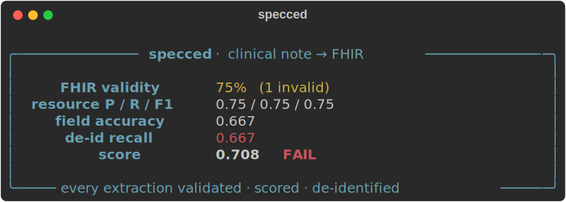
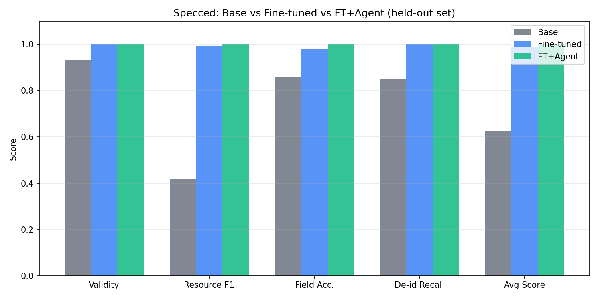

# Specced


[](LICENSE)

A local-first toolkit that turns free-text clinical notes into **de-identified, terminology-coded,
schema-valid FHIR**. A locally fine-tuned small model runs inside a `plan → retrieve → act →
evaluate` agent loop, and **every output is validated against the FHIR schema and scored
field-by-field against gold** — because in a regulated domain, "looks right" isn't good enough.

**Local-first** — PHI never leaves the box (HIPAA-aligned); there is no hosted demo by design.

[](docs/ARCHITECTURE.md)

## Results

Three-way comparison on 20 held-out cases (Qwen2.5-Coder-7B, RTX 5060 Ti 16 GB):

| Metric | Base model | Fine-tuned | FT + Agent |
|---|---|---|---|
| **Passed** | 0 / 20 | **20 / 20** | **20 / 20** |
| **Resource F1** | 0.416 | 0.992 | **1.000** |
| **FHIR Validity** | 0.932 | 1.000 | **1.000** |
| **De-id Recall** | 0.850 | 1.000 | **1.000** |
| **Avg Score** | 0.627 | 0.990 | **1.000** |
| Latency / note | 29.8 s | 22.7 s | 23.2 s |

Fine-tuning (160 examples, 17 min, QLoRA NF4): **0 → 20 passing cases, +0.576 avg score**.
Agent self-refine: closes the remaining gap to perfect on this held-out set. Latency overhead: +0.5 s/note.



Reproduce with one command (requires trained adapter):
```bash
make compare
```

## Features

- **De-identification** — surfaces PHI spans (HIPAA Safe Harbor categories); recall is gated ≥ 0.95 because a missed span is a leak.
- **FHIR extraction** — emits R4 resources (Condition, MedicationStatement, Observation, AllergyIntolerance, …) from messy clinical text.
- **Terminology coding** — binds concepts to SNOMED / RxNorm / ICD-10 / LOINC via a vector RAG index.
- **Eval harness** — the oracle: version-aware FHIR schema validation, resource & field-level precision/recall/F1 vs gold, de-id recall, and an optional clinical LLM judge. One gate used everywhere: data, training, agent.
- **Data pipeline** — PHI-safe synthetic `note → gold FHIR` generation with **reject-sampling**: a candidate enters training only by passing the eval harness.
- **QLoRA fine-tuning** — Unsloth + TRL, NF4 4-bit, fits a 16 GB GPU. val_loss=0.0107 in 17 min on 160 examples.
- **Agent loop** — LangGraph `plan → retrieve → act → evaluate` with self-refinement on FHIR validation errors. Errors from the eval harness are fed back into the prompt so the model can fix them.
- **Local & on-prem** — the fine-tuned model is served locally (Ollama / direct HF); data never leaves the host.

## Tech stack

| Concern | Choice |
|---|---|
| Language | Python |
| Base model | Qwen2.5-Coder-7B-Instruct |
| Fine-tuning | Unsloth + TRL — QLoRA (NF4), fits a 16 GB GPU |
| Eval | `fhir.resources` validation + custom field-F1 / de-id harness |
| Orchestration | LangGraph (plan → retrieve → act → evaluate) |
| RAG | LanceDB + sentence-transformers (all-MiniLM-L6-v2) |
| Teacher / judge | Anthropic Claude (Sonnet 4.6 bulk · Opus 4.8 judge) |
| Data | Faker + curated terminology KB (real RxNorm / ICD-10 / SNOMED / LOINC codes) |
| Serving | Ollama (GGUF); direct HF inference for eval |

## Quick start

```bash
# 1. Install
pip install -e ".[evals,data,train,agent]"

# 2. Score the example case (no model needed)
python -m evals.cli specs/examples/cardio-visit.json

# 3. Build a synthetic dataset (offline, no API key)
python -m data.build --n 50 --offline --seed 42

# 4. Fine-tune (requires dataset + 16 GB GPU)
python -m train.train_qlora --data data/curated --config train/configs/default.yaml

# 5. Build the RAG terminology index
python -m rag.index

# 6. Run the agent on a held-out case
python -m agent.run data/curated/held_out.jsonl --max-refines 3

# 7. Or via the CLI
specced eval specs/examples/cardio-visit.json
specced extract my_note.txt --adapter train/checkpoints/adapter
```

Set `ANTHROPIC_API_KEY` to enable Claude note-writer + teacher reject-sampling in step 3.

## Project structure

```
evals/      Eval harness (the oracle): FHIR validity, field-F1, de-id recall, judge, benchmark
data/       Data pipeline: synthetic (note → gold FHIR) generation + reject-sampling
agent/      LangGraph plan→retrieve→act→evaluate graph + self-refine
rag/        Terminology vector index (LanceDB + sentence-transformers)
train/      Unsloth/TRL QLoRA fine-tuning + GGUF export
serve/      Inference client (HF direct / Ollama)
cli/        `specced` command-line tool
specs/      Extraction-case JSON schema + example case/prediction
tests/      pytest suite
docs/       SPEC, ARCHITECTURE, OPERATIONS, blog posts
```

## Architecture

**Pattern:** `plan → retrieve → act → evaluate`. Read the note and target resource types → retrieve
candidate standard codes (`rag/`) → the fine-tuned model emits `{ phi_spans, resources }` (`serve/`)
→ the eval harness validates and scores it; on a FHIR-validation or low-score failure, the specific
errors are fed back into **act** and it retries (≤ N self-refine iterations).

The same harness is the oracle everywhere — CLI, the data reject-sampler, and the agent's evaluate
step all call `evals/run_eval.py`. **Training target is always the gold** — the Claude teacher is a
consistency filter, never the label source ("consistency-filtered synthetic supervision").

See **[docs/ARCHITECTURE.md](docs/ARCHITECTURE.md)** for the full directory map and data-pipeline flow.

## Evaluation

```bash
python -m evals.cli specs/examples/cardio-visit.json        # score one case
python -m evals.benchmark --data data/curated/held_out.jsonl # base vs FT
make compare                                                  # base vs FT vs FT+agent + chart
```

The harness gates on: FHIR schema validity → resource P/R/F1 → field accuracy → de-id recall (≥ 0.95,
safety gate). Aggregate score ≥ 0.7 AND de-id ≥ 0.95 = pass. See **[evals/README.md](evals/README.md)**.

## Blog posts

Design and engineering write-ups in **[docs/blog/](docs/blog/)**:

1. [Reject-sampling as a data philosophy](docs/blog/01-reject-sampling.md)
2. [QLoRA on 16 GB — fitting a 7B model on a consumer GPU](docs/blog/02-qlora-16gb.md)
3. [How do you eval FHIR extraction?](docs/blog/03-eval-fhir.md)
4. [Self-refine on schema errors](docs/blog/04-self-refine.md)
5. [De-id recall as a safety metric](docs/blog/05-deid-recall.md)
6. [Local vs Claude: cost, latency, privacy](docs/blog/06-local-vs-claude.md)

## Make targets

| Target | Purpose |
|---|---|
| `make eval` | Score the example case |
| `make data` | Build dataset (Claude note-writer when API key set) |
| `make data-offline` | Build small dataset offline |
| `make train` | Fine-tune Qwen2.5-Coder-7B with QLoRA |
| `make export-gguf` | Merge adapter + export GGUF for Ollama |
| `make rag-index` | Build terminology vector index |
| `make benchmark` | Base vs fine-tuned on held-out set |
| `make compare` | Three-way comparison + bar chart |
| `make agent-run` | Run agent on first held-out case |
| `make test` | Run pytest suite |
| `make gate` | Quality gate: pytest + offline data build |

## Roadmap

- [x] **US-1** — Spec-first scaffold + eval harness
- [x] **US-2** — Data pipeline: synthetic generator → Claude note-writer → reject-sampling
- [x] **US-3** — QLoRA fine-tune (Qwen2.5-Coder-7B) + local serving + baseline evals
- [x] **US-4** — LangGraph agent: plan → retrieve → act → evaluate + self-refine
- [x] **US-5** — Terminology RAG (SNOMED / RxNorm / ICD-10 / LOINC)
- [x] **US-6** — Full eval pipeline + three-way comparison + bar chart
- [x] **US-7** — CLI (`specced extract` / `specced eval` / `specced compare`)
- [x] **US-8** — Write-up + blog series

## Documentation

- **[CLAUDE.md](CLAUDE.md)** — agent guardrails: rules, output contract, hard constraints.
- **[docs/SPEC.md](docs/SPEC.md)** — task spec, data model, output contract, non-functional requirements.
- **[docs/ARCHITECTURE.md](docs/ARCHITECTURE.md)** — how the code fits together.
- **[docs/OPERATIONS.md](docs/OPERATIONS.md)** — local serving, no-PHI policy, reproducibility.
- **[STORIES.md](STORIES.md)** — user-story backlog.
- **[CONTRIBUTING.md](CONTRIBUTING.md)** — dev workflow, conventions, quality gate.
- **[SECURITY.md](SECURITY.md)** — vulnerability disclosure and no-real-PHI policy.

## License

[MIT](LICENSE)
